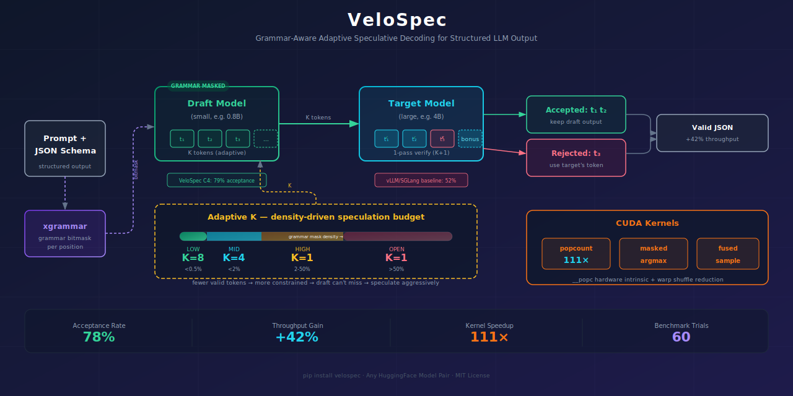

<div align="center" id="velospectop">  


[](https://opensource.org/licenses/MIT)
[](https://www.python.org/downloads/)
</div>

> Grammar-aware adaptive speculative decoding for structured LLM output.


Speculative decoding accelerates LLM inference by having a small draft model guess
K tokens ahead, then verifying them in one target model forward pass. But when
generating **structured output** (JSON, tool calls), the acceptance rate craters —
the draft model doesn't know the grammar constraints and wastes proposals on
invalid tokens.

<p align="center">
  
</p>

**VeloSpec fixes this with two techniques:**

1. **Grammar-guided drafting** — applies the grammar bitmask to the draft model too,
   so it only proposes grammar-valid tokens.
2. **Adaptive speculation budget** — uses grammar mask density as a forward-looking
   signal to dynamically set K: speculate aggressively when constrained, conservatively
   when free. No training required.

## Results

Benchmarked on Qwen3.5-4B / 0.8B (vocab=248,320), 60 trials across 4 configs × 3 schemas × 5 prompts:

| Config | Description | Tool-call Acceptance | vs. vLLM |
|--------|-------------|---------------------|----------|
| C1 | Free spec (no grammar) | 77% | — |
| C2 | Verify-only grammar (= vLLM / SGLang) | **52%** | baseline |
| C3 | Grammar-guided draft (this project) | **78%** | +26% accept |
| **C4** | **C3 + adaptive K (this project)** | **79%** | **+42% throughput** |

### Triton Fused Logit Processor (validated on A100)

Replaces xgrammar mask + PyTorch argmax + CPU popcount with a single fused two-pass
Triton kernel. Batch mode processes all K+1 verify positions in one kernel launch.

**Correctness:** ✅ verified across 5 vocab sizes (128 – 248,320), all edge cases pass.

**Performance (A100-SXM4, fp16, vocab=248,320):**

| Mode | K+1 positions | Triton | PyTorch baseline | Speedup |
|------|---------------|--------|-------------------|---------|
| Single-row | 1 | 77 μs | 101 μs | 1.3× |
| **Batch** | **6** (K=5) | **83 μs** | **649 μs** | **7.8×** |
| Batch | 8 | 76 μs | 877 μs | 11.5× |
| Batch | 12 | 77 μs | 1331 μs | 17.3× |

> Batch mode time stays flat as K+1 grows — A100's 108 SMs parallelize rows for free.
> At K=5 (VeloSpec default), the fused kernel saves ~566 μs per verify round.

Custom CUDA kernels deliver **111× speedup** on the grammar mask density computation
(`__popc` hardware intrinsic + warp shuffle reduction).

## Installation

```bash
pip install velospec

# Optional: build CUDA kernels for 111× faster density computation
pip install ninja
python setup.py build_ext --inplace
```

## Quickstart

```python
from velospec import VeloSpec

engine = VeloSpec(
    target_model="Qwen/Qwen3.5-4B",
    draft_model="Qwen/Qwen3.5-0.8B",
    config="C4",  # Grammar-guided draft + adaptive K
)

result = engine.generate(
    prompt="Call a function to search for AI news.",
    schema={
        "type": "object",
        "properties": {
            "function": {"type": "string", "enum": ["search", "get", "post"]},
            "arguments": {"type": "object"},
        },
    },
)

print(result.text)          # {"function": "search", "arguments": {"query": "AI news"}}
print(result.acceptance_rate)  # 0.7865
print(result.tokens_per_sec)   # 5.3
print(result.k_trace)          # [(0.000198, 8), (0.000110, 8), ...]
```

## CLI

```bash
# Generate structured output
velospec generate \
    --target Qwen/Qwen3.5-4B \
    --draft Qwen/Qwen3.5-0.8B \
    --config C4 \
    --schema benchmarks/schemas/schema_tool_call.json \
    "Call a function to search for AI news"

# Run full benchmark (4 configs × 3 schemas × 5 prompts)
velospec bench \
    --target Qwen/Qwen3.5-4B \
    --draft Qwen/Qwen3.5-0.8B \
    --configs C3,C4 \
    --schemas tool_call
```

## How It Works

### The problem: acceptance rate craters under grammar

```
Position: {"function" → next token
  Grammar:    only " is legal (closing the key string)
  Draft:      : (thinks the key is done — doesn't know grammar)
  Target:     " (grammar forces it)
  Result:     REJECT ❌ — draft wasted a proposal
```

For tool-call schemas, acceptance drops from 77% → 52% — nearly half of all draft
tokens are wasted. Speculative decoding's speedup evaporates.

### C3: grammar-guided draft

Apply the grammar mask to the draft model. The draft can only propose grammar-valid tokens:

```
Position: {"function" → next token
  Grammar mask:  only " is legal → all other logits = -∞
  Draft (masked): " (forced to be correct)
  Target:         "
  Result:         ACCEPT ✅
```

### C4: adaptive K via grammar density

The grammar bitmask density varies dramatically by position:

| Position type | Valid tokens | Density | Optimal K |
|---|---|---|---|
| JSON key boundary | ~2 | 0.001% | K=8 (guess aggressively) |
| Free-form text value | ~5000+ | 2%+ | K=1 (conserve compute) |
| Enum field | ~3 | 0.002% | K=8 |

VeloSpec reads the bitmask popcount before each draft round and sets K dynamically:

```
density < 0.005 → K=8    (high constraint, draft can't miss)
density < 0.02  → K=4    (moderate constraint)
else            → K=1    (low constraint, draft will likely diverge)
```

This is a **zero-cost, forward-looking** signal — no trained prediction head,
no EMA lag. SpecDec++ (ICML 2024) proved that the optimal K policy is a threshold
policy; grammar density is a deterministic estimator of that threshold.

## Four Configurations

| Config | K | Draft grammar | Target grammar | Output valid? |
|--------|---|---|---|---|
| C1 | Fixed | ❌ | ❌ | ❌ |
| C2 | Fixed | ❌ | ✅ (= vLLM/SGLang) | ✅ |
| C3 | Fixed | ✅ | ✅ | ✅ |
| **C4** | **Adaptive** | ✅ | ✅ | ✅ |

## CUDA Kernels

Three custom kernels accelerate the hot paths:

| Kernel | File | Technique | Speedup |
|--------|------|-----------|---------|
| popcount_density | `popcount_density.cu` | `__popc` + warp shuffle reduction | **111×** |
| grammar_masked_argmax | `grammar_masked_argmax.cu` | Fused mask+argmax, 1 block/position | — |
| fused_sample | `fused_sample.cu` | Online softmax, 5× memory reduction | — |

Build: `python setup.py build_ext --inplace`

Validate: `python tests/test_kernels.py`

## API Reference

### `VeloSpec(target_model, draft_model, config, K, device, dtype)`

| Parameter | Type | Default | Description |
|-----------|------|---------|-------------|
| `target_model` | `str` | required | HuggingFace model ID for the target model |
| `draft_model` | `str` | required | HuggingFace model ID for the draft model |
| `config` | `str` | `"C4"` | One of `"C1"`, `"C2"`, `"C3"`, `"C4"` |
| `K` | `int` | `5` | Speculation width (serves as K_MAX for C4) |
| `device` | `str` | `"auto"` | Device placement |

### `.generate(prompt, schema, max_tokens) → GenerationResult`

| Parameter | Type | Default | Description |
|-----------|------|---------|-------------|
| `prompt` | `str` | required | Input prompt |
| `schema` | `dict \| str \| None` | `None` | JSON schema (dict, JSON string, or file path) |
| `max_tokens` | `int` | `256` | Maximum tokens to generate |

Returns `GenerationResult` with:
- `.text` — decoded output text
- `.token_ids` — list of token IDs
- `.acceptance_rate` — draft acceptance rate
- `.tokens_per_sec` — throughput
- `.k_trace` — list of `(density, K)` tuples (C4 only)
- `.density_trace` — list of density values per verified position

## Project Structure

```
spec-decoding/
├── velospec/                    ← Python package
│   ├── __init__.py              ← Public API (lazy imports)
│   ├── engine.py                ← VeloSpec class + speculative_decode
│   ├── adaptive_k.py            ← Density → K controller
│   ├── cli.py                   ← CLI entry point
│   ├── kernels/                 ← CUDA kernels (density, argmax, sampling)
│   └── triton/                  ← Triton kernels (fused logit processor)
│       └── fused_logit_processor.py ← Batch fused masked argmax + density
├── benchmarks/                  ← Benchmark schemas
├── tests/                       ← Kernel validation tests
├── examples/                    ← Quickstart demo
├── docs/                        ← Detailed project docs & specs
├── results/                     ← Benchmark data
├── setup.py                     ← CUDA extension build
└── pyproject.toml               ← Package metadata
```

## Related Work

- **SpecDec++** (ICML 2024) — adaptive candidate length via trained acceptance head
- **SGLang Adaptive Spec** — EMA-based K adaptation (reactive)
- **GAD** (NeurIPS 2024) — local masking distributional bias
- **vLLM / SGLang** — production systems analyzed for this project

## License

MIT
